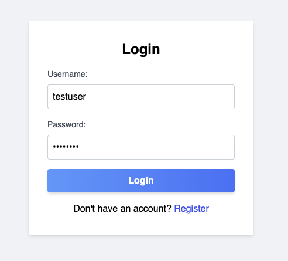

### Setup Steps

1. `pip install -r requirements.txt` - Install python dependencies
2. `npm install` - Install node dependencies

3. Setup config vars:
update the .env file with the following:
    ```
    DATABASE_URL="file://YOUR_PATH_TO/steno/storage/sqlite.db"
    ```
Update the `app.config['SQLALCHEMY_DATABASE_URI'] =` path in `./steno.py` to match the path in the .env file but with sqlite://// instead of file://
`sqlite:////Users/erikbahena/Desktop/steno/storage/sqlite.db`

4. `npm run start` - Start the app: frontend, backend, and data explorer
 - Serves: http://localhost:3000/index.html - Frontend
 - Opens: http://localhost:5555/ - Data explorer
 - Starts: Backend API server at http://localhost:5000/

Wait until you see that the backend server is running before continuing to the next step:
``` bash
 * Running on all addresses (0.0.0.0)
 * Running on http://127.0.0.1:5000
 * Running on http://10.0.0.12:5000
```

5. Click the login button
- Theres already a test user with `username: testuser` and `password: testuser`


6. Choose a file to upload


7. Click the `Start Transcription` button
